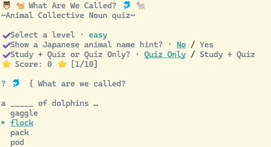

# What Are We Called? ~ Animal Collective Noun Quiz ~

This package is a simple CLI game for learning animal collective nouns.



# How to use

1. Run the quiz.

```
npx animal-collective-quiz
```

2. Select a level.
   There are three levels: easy, normal, and difficult.
   Each level has 10 animals.

3. Choose whether to show Japanese hints.
   If you enable Japanese hints, you can see the animal name in Japanese during the quiz.

4. Select a mode.
   You can choose either "Study + Quiz" mode or "Quiz Only" mode.
   In "Study + Quiz" mode, you can read the explanations before starting the quiz.

# Quiz

Each quiz has 10 questions.
You choose the correct answer from four choices.

# Note

The origins of collective nouns may vary, and the explanations in this package are only one example.

# Required Libraries

This package depends on the following library:

- [enquirer](https://www.npmjs.com/package/enquirer)
